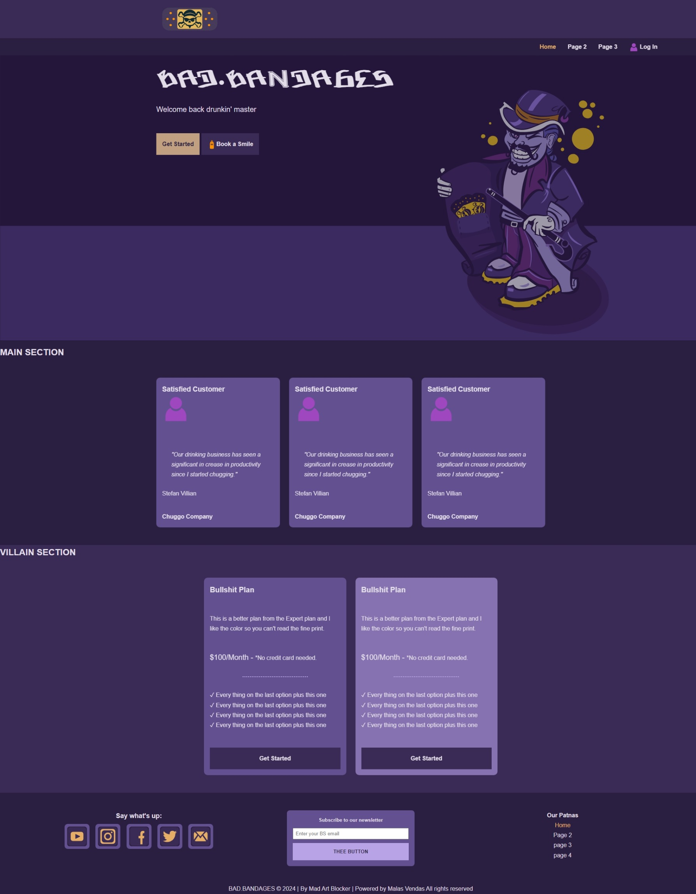

# Bad Bandages HTML CSS Framework

## Ongoing development of an HTML and CSS framework

HTML and CSS framework with minimal JavaScript (you doin't even need the JaviScreept). Quickly get stated on some static web pages, wiki, links index notes etc... [Vite](https://vitejs.dev/) build tool is used for a simple workflow.

